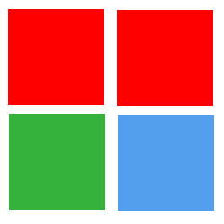

# Game Play

The idea of the game is to merge different coloured blocks to create a shape based off of a tetrimino. Merging two blocks the same colour creates a shape and changes the colour. Merge all of the blocks until you have the shape.

1. Several different colour blocks are displayed in a grid,
2. Tap two adjacent blocks of the same colour,
3. The blocks merge together and change colour,
4. Repeat until you have the final shape.

- 
- 
- 
- 

There's a colour chain of e.g. red -> green -> blue, which informs how the blocks change colour.

There's an indicator showing what shape you need to create.

The game gets harder by:

1. Introducing more blocks
2. Introducing more colours
3. Removing the colour from the target indicator